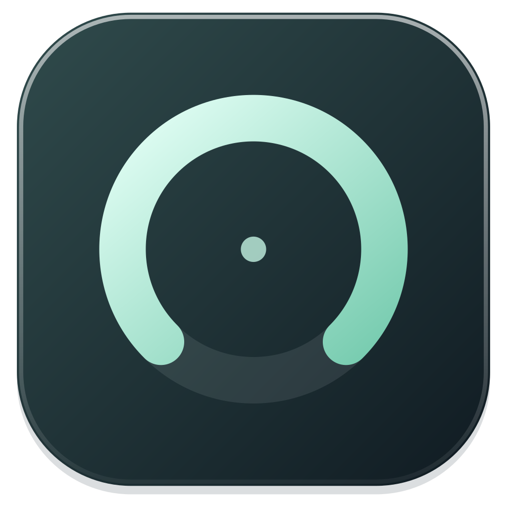
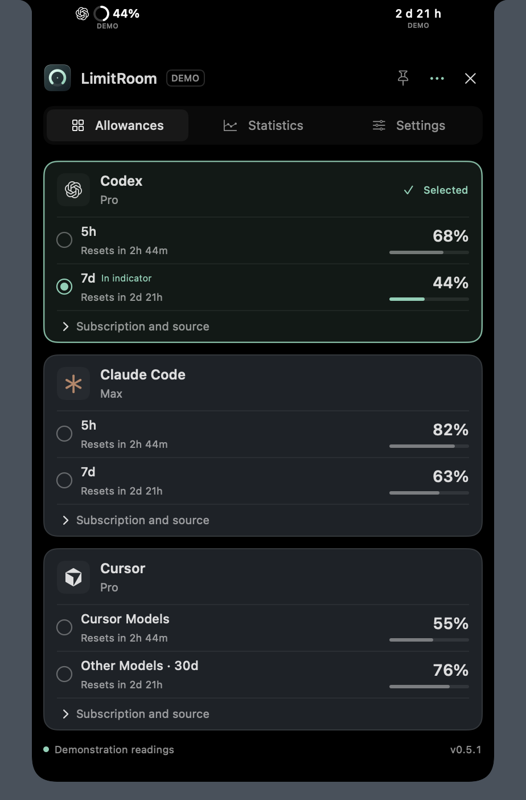
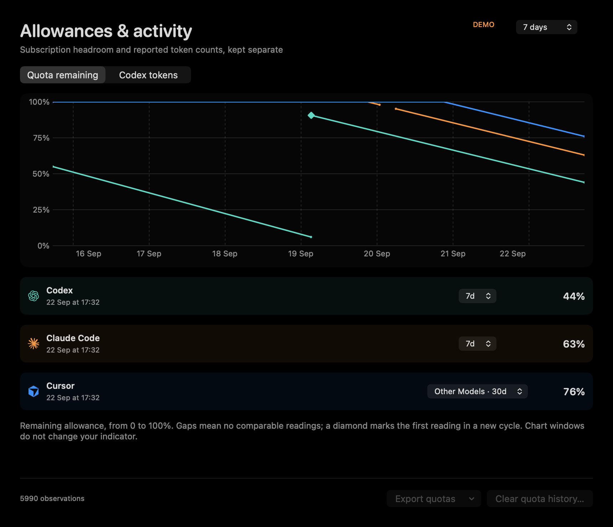
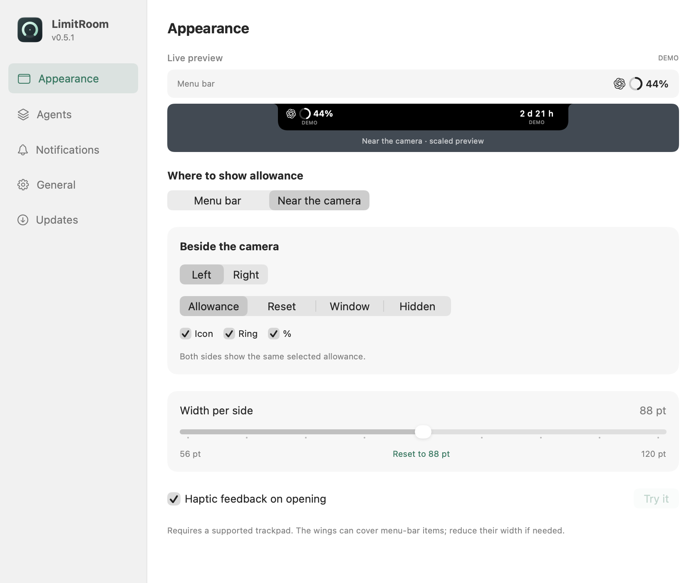

<p align="center">
  
</p>

<h1 align="center">LimitRoom</h1>

<p align="center"><strong>Room for your next idea.</strong><br>Know how much AI coding quota you have left, without leaving your flow.</p>

<p align="center">
  <a href="https://github.com/rvrhiv/LimitRoom/releases/latest"><strong>Download for macOS</strong></a> ·
  <a href="docs/usage.md">Getting started</a> ·
  <a href="README.ru.md">Русский</a>
</p>

<p align="center">
  <a href="https://github.com/rvrhiv/LimitRoom/actions/workflows/ci.yml"></a>
  <a href="LICENSE"></a>
  
</p>

LimitRoom is a native macOS quota monitor for **Codex, Claude Code, and Cursor**. Pin the allowance that matters to your menu bar, or let it live beside your MacBook's notch. Open one panel to see the rest.

<p align="center">
  
  
</p>

<p align="center"><sub>Actual app views rendered with demonstration data. No personal accounts or usage are shown.</sub></p>

## A little more headroom

- **One glance, one chosen quota.** An agent icon, remaining-allowance ring, and percentage. Choose which parts to show; switch the pinned window from any agent card.
- **Two ways to stay out of the way.** Click the menu-bar indicator, or hover over the notch to reveal all three cards. A pin keeps the notch panel open when you need it.
- **See your pace.** Keep 90 days of local history, compare observed consumption trends, and export CSV or JSON. Charts measure changes in quota percentages, not tokens or cost.
- **Make it feel like your Mac.** Live display previews, light and dark appearance, optional haptics, Reduce Motion support, and English or Russian based on your system language.
- **Stay in control.** Refresh every 1, 5, 30, or 60 minutes; opt into low-quota notifications and choose whether to launch at login. Signed app updates install only when you choose.

<p align="center">
  
</p>

## Get started

1. Download the ZIP from the [latest release](https://github.com/rvrhiv/LimitRoom/releases/latest).
2. Quit any older LimitRoom instance, unzip, and move **LimitRoom.app** to **Applications**.
3. Open the app, connect your agents in **Settings → Agents**, and select a quota to pin.

Requires **macOS 14 or later**. Universal builds include **Apple Silicon and Intel**. Notch mode requires a supported built-in notched display; other setups use the menu bar.

### First launch on macOS

Current releases are ad-hoc signed, without Apple Developer ID or notarization. macOS may say it cannot verify LimitRoom or check it for malicious software.

If you downloaded the app from this repository's releases and trust the build:

1. Try opening **LimitRoom.app** in **Applications**, then dismiss the warning without moving the app to Trash.
2. Go to **System Settings → Privacy & Security**, scroll down, and click **Open Anyway** for LimitRoom.
3. Confirm with **Open**; authenticate if requested.

This allows this app without disabling Gatekeeper. Do not bypass warnings about detected malware or a damaged app. See [Apple's instructions](https://support.apple.com/en-us/102445) and the [installation notes](docs/usage.md#installation).

## Your agents, together

| Agent | Connection | What to expect |
| --- | --- | --- |
| **Codex** | Your installed Codex CLI and existing ChatGPT sign-in | Subscription windows reported by Codex; requires a CLI with App Server support. |
| **Claude Code** | An explicitly enabled, reversible status-line helper | Quotas reported by an active Claude Code session; availability depends on its version and subscription. |
| **Cursor** | Your installed Cursor session, with your permission | **Experimental** personal usage via Cursor's private dashboard endpoints; compatibility can change. An isolated web sign-in is also available. |

One active account per agent. Subscription details and reset times appear when the source provides them. Missing or stale data stays visibly missing or stale — it never becomes a made-up balance. [Connection guide →](docs/usage.md#connect-your-agents)

## Local-first by design

No LimitRoom account, backend, or telemetry. History stays on your Mac. LimitRoom does not read your conversations or import browser cookies. Network requests go to the enabled agent's service and GitHub for updates; the app is not fully offline. [Data and privacy →](docs/usage.md#data-and-privacy)

## Build and contribute

With full Xcode and Swift 6 installed:

```sh
git clone https://github.com/rvrhiv/LimitRoom.git
cd LimitRoom
bash Scripts/build-app.sh Release
open build/LimitRoom.app --args --demo
```

Demo mode previews the UI without reading agent accounts or writing personal usage history. The build script leaves your installed app untouched.

[Contributing](CONTRIBUTING.md) · [Architecture](docs/architecture.md) · [Releasing](docs/releasing.md) · [Report a bug](https://github.com/rvrhiv/LimitRoom/issues/new/choose) · [Security](SECURITY.md)

## License

[MIT](LICENSE) © 2026 rvrhiv. Third-party libraries and agent marks retain their own terms; see [third-party notices](THIRD_PARTY_NOTICES.md). LimitRoom is an independent project, not affiliated with OpenAI, Anthropic, or Anysphere.
