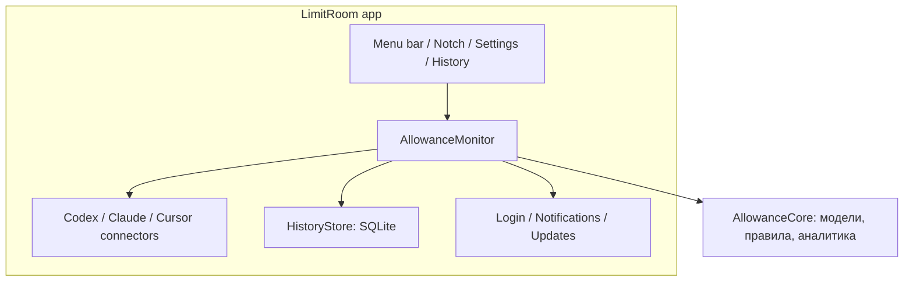

# LimitRoom: архитектура и границы первой версии

Статус: основа выбрана пользователем; уточнения интервью от 20–21 сентября 2026 включены.

Документ описывает целевую v1. Текущий реализованный инкремент и непроверенные/отложенные пункты перечислены в [verification.md](verification.md). Наличие требования ниже не означает, что оно уже прошло live-проверку.

## Задача

Пользователь за один взгляд понимает остаток выбранной квоты, а за один клик — состояние подписок Codex, Claude Code и Cursor. Интерфейс ощущается частью macOS. Изменение источника одного агента не требует менять остальные источники, графики или способы отображения.

## Согласованные требования

- macOS 14+, SwiftUI, Universal: Apple Silicon и Intel.
- Menu bar: иконка агента, круглое кольцо и процент **остатка**; видимость компонентов настраивается. Выбраны один агент и окно. Клик открывает popover. Наведение не открывает панель.
- Альтернатива — единая панель у выреза встроенной камеры, раскрывающаяся по наведению/клику, с временным удержанием, анимацией и отключаемым тактильным откликом. При недоступном экране — menu bar без изменения предпочтения режима.
- Один активный аккаунт на агента; смена аккаунта не объединяет историю разных подписок.
- Полные доступные сведения: аккаунт, план, все возвращённые окна и пулы, остаток, следующий сброс, источник и время наблюдения. Дата оплаты и дата сброса квоты — разные поля.
- История показателей хранится локально 90 дней, доступна для экспорта CSV/JSON и полного удаления.
- Общий график: темп расхода одного выбранного аналитического окна каждого агента. Выбор графика независим от menu bar.
- Нативные уведомления выключены по умолчанию. Начальные пороги: 20% и 10% остатка, по одному событию на пересечение в пределах одного цикла.
- Автозапуск предлагается включённым при первичной настройке; учитывается фактический статус macOS, включая необходимость подтверждения. Отключение пользователем не отменяется автоматически.
- Русский и английский, автоматический выбор по языку macOS, системные форматы дат и чисел.
- Обновления через Sparkle и подписанные релизы GitHub. Для 0.5.0 пользователь разрешил публичный репозиторий после проверки приватности. Обновления не активируются без feed и публичного ключа.
- Нет облака LimitRoom, телеметрии, чтения разговоров и импорта браузерных cookies. Дополнительных агентов и экранов-заглушек для них в v1 нет.

## Выбранный подход

Модульное нативное приложение: Xcode-проект содержит приложение и Claude helper, локальный Swift package содержит независимые модули. Xcode отвечает за упаковку, ресурсы и подпись приложения.

Отдельный постоянный daemon пока не нужен: сбором управляет приложение. Это сокращает число процессов, схем авторизации и вариантов восстановления. Один SwiftUI target для всего отвергнут: модели, хранение и транспорт не должны зависеть от отображения.

### Модули и интерфейсы

| Модуль | Ответственность | Что не выходит наружу |
| --- | --- | --- |
| `AllowanceCore` | Идентичности, окна, наблюдения, состояния, закрепление, расчёт темпа | SwiftUI, Keychain, HTTP, файловые пути |
| `AllowanceConnectors` | `AllowanceConnector.read()` для независимых источников и чистая проекция Cursor payload | Форматы провайдеров и RPC |
| `AllowanceStorage` | SQLite, 90 дней хранения, экспорт и кэш последних показаний | SQL и структура файлов |
| `AllowanceRuntime` | Обновление, дедупликация, кэш, поколения подключения, запись истории | Детали отображения |
| `LimitRoom` | SwiftUI/AppKit, композиция, WebKit на MainActor, выбор/доставка уведомлений, настройки платформы | Не содержит расчёт аналитики или SQL |

Новые агенты добавляются адаптером и регистрацией его возможностей. Динамические плагины, загрузка кода извне и универсальная схема пользовательских скриптов не нужны.

WebKit-транспорт Cursor принадлежит приложению из-за изоляции MainActor. Новый `CursorLocalConnector` изолирует SQLite-чтение входа Cursor.app и HTTPS в отдельном actor. AppModel выбирает ровно один явно разрешённый режим и передаёт нормализованный снимок в monitor через `accept`; поколения конфигурации отбрасывают результаты отключённого источника. Токены не попадают в историю или кэш.

## Модель показателей

`AgentID → AccountScope → AllowanceWindow → Reading`.

- Устойчивый `WindowID` отражает источник, пул/модель и тип окна. Он не равен подписи «неделя» и не меняется с каждым reset.
- `AccountScope` разделяет аккаунты; когда источник не даёт надёжную идентичность, используем локальную эпоху подключения и не объявляем историю точно привязанной к человеку.
- `cycleID` или подтверждённый `resetsAt` отделяют циклы одной квоты. У rolling window отдельная семантика: разность остатка не всегда равна расходу из-за восстановления.
- Закрепляется **окно**, а не старый объект Reading. Обновления меняют показание, сохраняя выбор пользователя.
- Неизвестное значение, отсутствие окна, безлимит и исчерпание — разные состояния. Нельзя превращать `null` в `0` или рисовать полный индикатор при ошибке.
- Freshness (`observedAt`, `fetchedAt`) отделена от доступности источника. Повторное чтение локального файла не делает старое наблюдение свежим.
- Отображаемый остаток ограничен диапазоном 0…100. Исходное значение сохраняется для диагностики; отрицательные и нечисловые значения отвергаются.
- Метаданные подписки опциональны. Название плана не даёт основания выдумывать цену, дату оплаты или число оставшихся запросов.

## Источники данных

### Codex

Используется установленный официальный `codex app-server` через private stdio-соединение: `initialize`, `initialized`, `account/read`, `account/rateLimits/read`. Приложение не создаёт задачи и не читает разговоры. Предпочитается `rateLimitsByLimitId`, fallback — `rateLimits`. Поддерживаются возвращённые сервером окна и дополнительные модельные пулы; фиксированные 5h/7d не зашиваются как единственные возможные значения.

Секретами управляет Codex. LimitRoom не копирует его auth-файл и не обновляет OAuth-токены самостоятельно. Путь к CLI можно выбрать явно, если он не найден в стандартных местах.

### Claude Code

As of 0.4, explicit setup is owned by `ClaudeSetup`, not `ClaudeConnector`: a private backup, immutable helper copy and recoverable receipt precede a compare-checked atomic settings replacement. Existing statusLine commands receive the original in-memory input and retain their output. Receipts retain the previous managed command to recover interrupted reconfiguration. Disconnect restores only statusLine. Each invocation embeds a fixed account scope; old terminals cannot publish into a new scope. User settings are never changed merely on app launch. This path is compiled and reviewed; live installation/forwarding remains an acceptance item.

Основной подтверждённый интерфейс — документированный `statusLine`. Небольшой bridge получает JSON от Claude, немедленно оставляет только `rate_limits`, время и допустимые метаданные; `transcript_path`, пути проектов и другие поля не сохраняются и не читаются.

Подключение bridge — явное действие в настройках LimitRoom. Существующий `statusLine` сохраняется, изменение показывается пользователю и обратимо. LimitRoom не перезаписывает чужую конфигурацию при запуске. До подключения — «Требуется подключение», после него данные зависят от активности Claude; периодическое чтение файла не равно новому запросу к Anthropic.

### Cursor

Личная подписка остаётся требованием v1. Публичная Admin API команд не считается источником её квоты: team и personal учитываются отдельно. Отдельный Team/Enterprise режим не расширяет минимальный релиз без реальной необходимости.

Основной экспериментальный способ — «Подключить Cursor.app…». Только после подтверждения приложение читает единственную запись `cursorAuth/accessToken` в локальной базе установленного Cursor. SQLite открывается read-only через явный Unix VFS с `readonly_shm=1`: обычного read-only недостаточно для запрета записи SHM. Действующий WAL не игнорируется, immutable допускается лишь без обоих sidecar-файлов. Несовместимый SQLite или недоступное хранилище приводят к отказу без менее безопасного повторного открытия. TEXT/UTF-8 и ASCII UTF-16LE BLOB поддерживаются. Сессия проверяется на формат, срок и безопасный subject; JWT не считается криптографически проверенной идентичностью.

Эфемерный URLSession отправляет сессию только на фиксированные HTTPS `/api/usage-summary` и `/api/auth/me` у `cursor.com`, без редиректов, общего cookie/credential store и кэша. Ответы ограничены 64 КиБ каждый и 12 секундами. Идентичность сервера должна совпасть с subject; повторное чтение локальной сессии защищает от смены аккаунта во время запроса. Пароль, чаты, проекты, браузеры и Keychain не читаются. Токен не сохраняется и не обновляется. Отключение оставляет вход Cursor.app нетронутым.

При запуске старый Cursor snapshot с диска не показывается до проверки текущего аккаунта. В пределах работающего приложения ошибка транспорта может оставить только измерение того же подтверждённого аккаунта с прежним временем и меткой stale. Ошибки авторизации/формата/смены аккаунта очищают показания. Старые наблюдения истории не удаляются и не смешиваются.

Альтернатива — явный web-вход в собственном профиле WebKit LimitRoom. Cookies других приложений не импортируются; автоматического переключения между источниками и аккаунтами нет. WebKit хранит только собственную web-сессию. Старое разрешение web-входа не включает чтение Cursor.app.

Проекция берёт только `individualUsage`: отдельные Cursor Models, Other Models, Total. Если Total отсутствует, процент допустим по явно данным `used/limit` при положительном лимите. `individualUsage.overall` показывается отдельным личным лимитом расходов, а не включённой квотой или командным пулом. Отсутствующие поля не превращаются в нули.

Открытый вопрос **реализуемости**, а не автоматическое обещание: отдельный вход не создаёт публичный usage API. Сначала проверяются сам flow входа и доступный контракт данных. При неподтверждённом чтении приложение открывает официальный dashboard и сообщает о недоступности автоматической квоты. Оно не показывает тестовые цифры как личные. Поддержка live personal считается законченной только после проверки реального входа и соответствия показаний dashboard.

## Обновление и ошибки

Интервал чтения квот настраивается для всех агентов: 1, 5, 30 минут или час; по умолчанию 5 минут. `QuotaRefreshInterval` ограничивает допустимые значения, AppModel сохраняет выбор в UserDefaults. Единственный 30-секундный display clock проверяет, наступил ли срок опроса; сетевой запуск может отставать от выбранного интервала до одного тика плюс длительность текущего чтения. Более короткий интервал применяется сразу, если чтение уже пора запускать. Изменение не создаёт таймеров и не отменяет текущие запросы. Ручное обновление и обновление после сна сохраняются; общие ограничения на параллельное чтение и частоту запросов действуют во всех путях. Частота проверки релизов Sparkle независима. При длинном интервале сохраняется честная метка устаревания показаний. У адаптера свой минимальный интервал; concurrent запросы объединяются. Ошибка одного агента не отменяет удачное обновление остальных. Нужны timeout, отмена и backoff; после 429 учитывается Retry-After.

Последнее корректное наблюдение остаётся видимым с меткой времени и причиной ошибки. Состояние становится устаревшим после допустимого срока конкретного источника либо после прошедшего reset. В момент reset обновляем источник; автоматически подставлять 100% нельзя.

## История и аналитика

SQLite хранит только разрешённые показатели и идентичности окон, одним writer-actor. Индекс: `(agent, accountScope, windowID, observedAt)`. Дубликаты одного наблюдения не добавляются. Schema version и транзакционные миграции обязательны; основное приложение — единственный писатель.

Единица общего графика — **процентные пункты выбранного окна в сутки**:

`rate = (used₂ − used₁) / elapsedDays`.

Расчёт разрешён только для последовательных наблюдений одного аккаунта, окна, плана и цикла, без сброса/коррекции и большого разрыва. Пропуски отображаются разрывами; отрицательная разность не становится отрицательным расходом. Для rolling windows это только наблюдаемое изменение заполнения, не оценка полного потребления. Разные подписки имеют разные объёмы: график не измеряет стоимость, число токенов или эффективность моделей.

Общий график подписывает агента, окно и единицу. В деталях есть линия остатка и отметки reset. Прогноз — только приблизительный, при достаточной плотности истории и положительном темпе; иначе «недостаточно данных». Прогноз не гарантирует завершение конкретного задания.

Retention — 90 дней. Очистка и экспорт относятся к выбранным аккаунтам или всей истории по явному действию пользователя. Экспорт не содержит cookies, токенов, email, запросов или рабочих путей.

## Интерфейс

Menu bar и notch используют один `DashboardView`: три однотипные карточки со всеми доступными окнами, вкладки квот/статистики/настроек и версия сборки. Выбранная карточка выделена, точное окно отмечено селектором и подписью. Дополнительные сведения раскрываются внутри карточки. Обзор темпа доступен во вкладке; полная история и настройки подключений — в отдельных общих окнах.

Menu bar остаётся компактным: монохромная иконка агента, круглое кольцо и моноширинные цифры. `MenuBarIndicatorImage` рендерит их как единое template NSImage: MenuBarExtra не сохраняет произвольные SwiftUI Shapes в label. Предпросмотр настроек использует то же изображение. Устаревшее показание видно по символу/состоянию, а не только цвету. Порядок агентов стабилен; показания не пересортировываются на глазах. Light/Dark, VoiceOver, клавиатура, Reduce Motion и Reduce Transparency учитываются с первого экрана. Постоянного пульсирования и опроса ради анимации нет; полный аудит доступности ещё не выполнен.

### Владение представлениями

`AppModel` остаётся единственным владельцем runtime, снимков и выбора AgentID + WindowID. `PresentationPreferences` хранит режим, показ процента, haptics, содержимое сторон камеры, их ширину и формат сброса; demo не пишет эти значения. `PresentationCoordinator` реагирует на дисплеи, Spaces, сон и presentation options; `ApplicationWindows` переиспользует окна истории и настроек. Перед открытием настроек координатор сворачивает чёлку через общий `close()`, снимая временную булавку, но сохраняя компактный индикатор. Отдельный callback изменения компоновки сохраняет раскрытую вкладку и булавку при настройке ширины.

`NotchPanelController` владеет одной неактивирующей AppKit-панелью уровня `statusBar + 1` (выше status items, ниже native pop-up menus), закреплённой у верхнего края экрана. Её шапка включает физическую камеру без элементов управления и две настраиваемые стороны. Закрытая панель имеет высоту камеры; под ней ничего нет. Геометрия берётся из built-in `NSScreen.safeAreaInsets` и auxiliary areas. При анимации меняются x/ширина/высота, а смещение камеры пересчитывается из неизменной экранной координаты. У панели нет native shadow/обводки, фон чёрный; верхние плечи — внешние четверти окружности.

Локальный и глобальный мониторы движения мыши дополняют tracking area, чтобы наведение работало и над камерой при активном другом приложении. Они не сохраняют события и удаляются при скрытии. Глобального перехвата клавиатуры и фонового polling нет. Контроллер отменяет противоположные hover-задачи, сбрасывает удержание при lifecycle-скрытии и выполняет только конечные анимационные переходы. `NotchHeaderView` и `CompactIndicatorView` используются и в реальном отображении, и в живых предпросмотрах настроек.

Уровень панели задаётся после `isFloatingPanel`, поскольку AppKit иначе сбрасывает его до 3. Участие в Spaces — stationary; обычные уведомления смены Space/параметров экрана больше не скрывают панель безусловно. Reconcile скрывает её только по действующей политике доступности экрана/fullscreen/сна/сессии. Открытие использует нативный haptic `.levelChange` с `.now`, пользовательским переключателем и cooldown 800 мс; сила зависит от устройства. Disclosure-заголовки используют общий полноширинный Button с hover и доступным состоянием.

Схема истории SQLite не изменена. Боковые блоки занимают место в системном меню: ОС не резервирует для них свободную область. Подробности, ограничения и критерии проверки: [исправления native UI и Cursor](superpowers/specs/2026-09-21-native-indicator-cursor-design.md).

Presentation 0.4 uses `IndicatorComponents` independently for the menu bar and two camera wings. `AgentIcon` supplies the attributed monochrome OpenAI Blossom for Codex. A full remaining-allowance circle and separate icon replace the historical half-gauge. Defaults, migration, privacy and native acceptance boundaries are in [notch polish](superpowers/specs/2026-09-21-notch-polish-design.md) and [Claude setup](superpowers/specs/2026-09-21-claude-setup-design.md).

## Обновления и GitHub

Канал: публичный `rvrhiv/LimitRoom`, публикация только очищенного снимка исходников. Приватный GitHub release не является анонимным каналом загрузки. PAT владельца никогда не вшивается в приложение.

Sparkle 2.10.0 изолирован в `UpdateController` и `UpdateUserDriver` слоя App. Они не используют квоты или токены агентов. При отсутствии feed/public key сеть не запускается. Discovery подсвечивает версию; explicit install разрешает только показанный build/URL. Требуются подписанный feed и проверка архива до распаковки. Private Ed25519 key доступен только доверенному release job в GitHub Actions, с локальной резервной копией в Keychain. Это позволяет участникам выпускать версии без Mac владельца. Developer ID и Sparkle signature решают разные задачи; notarization пока отсутствует. Подробности: [releasing](releasing.md).

## Проверка и критерии завершения

- Пакет собирается Swift 6; app и helper targets собираются для arm64/x86_64 с deployment target macOS 14.
- Live-проценты сверяются с исходным приложением каждого агента. Demo-режим явно подписан и не пишет историю/не отправляет уведомления.
- Проверяются reset, ошибка источника, пробуждение Mac, отсутствие входа, смена аккаунта и восстановление из кэша.
- Для источников и исторических вычислений особенно важны автоматические проверки, но пользовательское AGENTS.md запрещает создавать новые тесты без назначенных test-case ID. ID отсутствуют: новые тесты не создаются; используются сборка и ручные проверки с записью результата. ID не придумываются.
- Локальная сборка, live-интеграция и подписанный релиз имеют отдельные статусы. Успешная компиляция не доказывает работу всех трёх.

## Первичные источники, проверенные 2026-09-20

- [Codex App Server](https://developers.openai.com/codex/app-server/).
- [Claude Code statusLine](https://code.claude.com/docs/en/statusline).
- [Cursor APIs](https://cursor.com/docs/api), [Admin API](https://cursor.com/docs/account/teams/admin-api), [usage and limits](https://cursor.com/help/models-and-usage/usage-limits).
- [CodexBar Cursor implementation](https://github.com/steipete/CodexBar/blob/main/Sources/CodexBarCore/Providers/Cursor/CursorStatusProbe.swift): первичный источник схемы стороннего dashboard-клиента, не публичная спецификация Cursor. Код не копировался.
- [Apple local packages](https://developer.apple.com/documentation/xcode/organizing-your-code-with-local-packages).
- [SMAppService](https://developer.apple.com/documentation/servicemanagement/smappservice).
- [Sparkle](https://sparkle-project.org/documentation/), [GitHub release assets](https://docs.github.com/en/rest/releases/assets).
